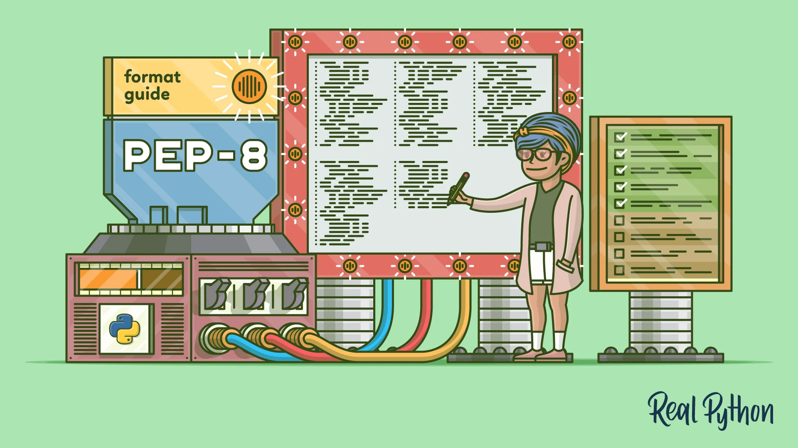

# Bonnes pratiques de programmation



*extrait du site https://realpython.com/python-pep8/*

## 1. Conventions syntaxiques
La programmation est un art délicat : un simple caractère en trop peut provoquer une erreur pour le code tout entier (penser à un innocent caractère d'espace en début de ligne dans un code Python).
Mais même lorsque le code s'exécute sans erreur, il ne faut pas négliger l'aspect purement esthétique du code. 
Il est nécessaire de respecter autant que possible des conventions typographiques qui vont «standardiser» le code et le rendre ainsi plus lisible.

Ainsi pour chaque langage, il existe une «bible» de bonnes pratiques de présentation du code, qui visent à l'uniformiser. Pour Python, cette référence s'appelle la Python Enhancement Proposal 8, plus connue sous le nom de PEP8. 

Vous trouverez un excellent résumé de la PEP8 sur le site http://sametmax.com/le-pep8-en-resume/.

En voici quelques extraits :

### Les espaces
▶ Il faut mettre une espace (oui, en typographie, on dit «une» espace et non pas «un» espace) avant et après chaque opérateur ```=, ==, +, >, ...``` 

```python
# PAS BIEN 
a=3

# BIEN 
a = 3
```

```python
# PAS BIEN
if x>3:
    print("ok")

# BIEN
if x > 3:
    print("ok")
```

▶ Pour les opérateurs mathématiques, on essaie de reconstituer les groupes de priorité (lorsqu'il y en a) :

```python
# PAS BIEN
x = 3*2

# BIEN
x = 3 * 2
```

mais 

```python
# PAS BIEN
x = 3 * 2 + 5

# BIEN
x = 3*2 + 5
```

▶ On ne met pas d'espace à intérieur des parenthèses, des crochets ou des accolades :

```python
# PAS BIEN
for x in range( 5 ):
    print( 'bonjour' )

# BIEN
for x in range(5):
    print('bonjour')
```

▶ Pour les virgules, et les deux points : 
pas d'espace avant mais une espace après.

```python
# PAS BIEN
if color == (0,255,0) :
    print('vert')

# BIEN
if color == (0, 255, 0):
    print('vert')
```

### Les conventions de nommage

▶ Les variables à une lettre (comme ```i```, ```j```, ```k``` ) sont réservées aux indices (notamment dans les boucles).

▶ Les autres variables doivent avoir des noms explicites, éventuellement écrits en ```snake_case``` .

```python
# PAS BIEN
if d == 1:
    cep += vm

# BIEN
if date == 1:
    compte_epargne += versement_mensuel
```


Rappel des différents types de casse :
- ```snake_case``` : les mots sont séparés par des underscores.
- ```CamelCase``` : les mots sont séparés par des majuscules
- ```kebab-case``` : les mots sont séparés par des tirets courts.
