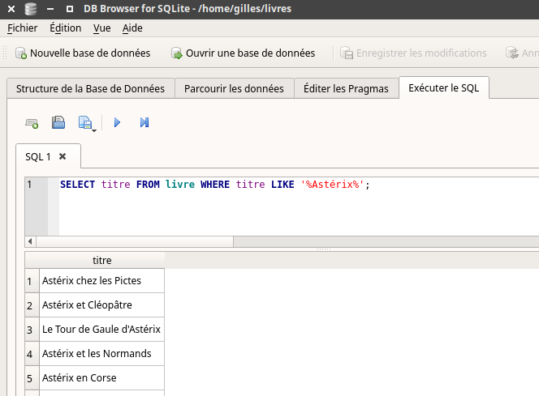
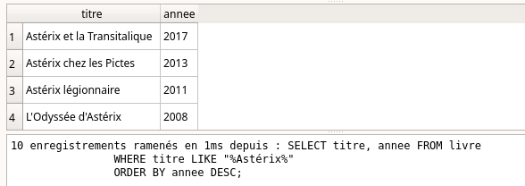

# Langage SQL

## 0. Du modèle relationnel au SGBD
Les considérations sur le modèle relationnel du [cours précédent](../4.1_Modele_relationnel/01_modele_relationnel.md) étaient uniquement théoriques. 

Il s'agissait de déterminer de manière la meilleure structure pour représenter les données et les relations qui les lient. 

Il convient maintenant d'aborder la partie logicielle : les SGBD (Systèmes de Gestion de Bases de Données).

[...]


## 1. Introduction au langage SQL


Dans toute la suite, nous allons travailler avec la base de données ```livres.db``` qui provient de l'ouvrage paru chez Ellipses, cité en bibliographie.

### 1.0 Différents moyens d'interroger la base de données
**Pré-requis :** téléchargez la base de données [livres.db](data/livres.db).

#### 1.0.1 En ligne : sqlonline
- Rendez vous sur https://sqliteonline.com/
- Par File / OpenDB, ouvrez le fichier  ```livres.db``` précédemment téléchargé.
- Écrivez votre requête plus cliquez sur Run.


#### 1.0.2 Avec un logiciel externe : DB Browser for SQLite
- Installez ```DB Browser for SQLite```, téléchargeable à l'adresse https://sqlitebrowser.org/
- Ouvrez le fichier ```livres.db```



#### 1.0.3 Au sein d'un notebook Jupyter
- Si nécessaire, installez via le terminal les paquets suivants :
```
sudo pip3 install jupyter-sql
sudo pip3 install ipython-sql
sudo apt install python3-sql
``` 
- Dans un notebook Jupyter, votre première cellule doit être 
```
%load_ext sql
%sql sqlite:///livres.db
``` 
en ayant bien pris soin de mettre le fichier ```livres.db``` dans le même répertoire que votre fichier Jupyter.

Ensuite, chaque requête devra être précédée de la ligne ```%% sql```.
 

--------

> Dans toute la suite, les manipulations sont à faire en interrogeant la base de données ```livres.db```, avec l'une des méthodes indiquées ci-dessus.
 Cette base de données contient les tables suivantes :
 

 ### 1.1. Sélection de données
 

#### 1.1.1 Exemple 1 : requête basique 🠖 SELECT, FROM, WHERE
- **Commande :** 
```sql
SELECT titre FROM livre WHERE annee >= 1990;
``` 
- **Traduction :** 

On veut les titres de la table «livre» qui sont parus après (ou en ) 1990;
- **Résultat :** (d'après DB Browser)  


#### 1.1.2 Exemple 2 : requête basique avec booléens 🠖 AND
- **Commande :** 
```sql
SELECT titre FROM livre WHERE   annee >= 1970 AND
                                annee <= 1980 AND
                                editeur = 'Dargaud';
``` 
- **Traduction :** 

On veut les titres de la table «livre» qui sont parus entre 1970 et 1980 chez l'éditeur Dargaud;
- **Résultat :** (d'après DB Browser)  


#### 1.1.3 Exemple 3 : requête approchée 🠖 LIKE
- **Commande :** 
```sql
SELECT titre FROM livre WHERE titre LIKE '%Astérix%';
``` 
- **Traduction :** 

On veut les titres de la table «livre» dont le titre contient la chaîne de caractères "Astérix". Le symbole ```%``` est un joker qui peut symboliser n'importe quelle chaîne de caractères. 
- **Résultat :** (d'après DB Browser)  


#### 1.1.4 Exemple 4 : renvoi de plusieurs colonnes
- **Commande :** 
```sql
SELECT titre, isbn FROM livre WHERE annee >= 1990;
``` 
- **Traduction :** 

On veut les titres et les ISBN de la table «livre» qui sont parus après 1990.
- **Résultat :** (d'après DB Browser)  


#### 1.1.5 Exemple 5 : renvoi de toutes les colonnes 
- **Commande :** 
```sql
SELECT * FROM livre WHERE annee >= 1990;
``` 
- **Traduction :** 

On veut toutes les colonnes disponibles de la table «livre» pour les livres qui sont parus après 1990.
L'astérisque ```*``` est un joker (*wildcard* en anglais).
- **Résultat :** (d'après DB Browser)  


#### 1.1.6 Exemple 6 : renommer les colonnes 🠖 AS
- **Commande :** 
```sql
SELECT titre AS titre_du_livre FROM livre WHERE annee >= 1990;
``` 
- **Traduction :** 

Lors de l'affichage du résulats et dans la suite de la requête (important), la colonne "titre" est renommée "titre_du_livre".
- **Résultat :** (d'après DB Browser)  


 ### 1.2. Des opérations sur les données : sélection avec agrégation

#### 1.2.1 Exemple 7 : nombre de résultats 🠖 COUNT
- **Commande :** 
```sql
SELECT COUNT(*) AS total FROM livre
                             WHERE titre LIKE "%Astérix%";
``` 
- **Traduction :** 

On veut compter le nombre d'enregistrements de la tables livres comportant le mot "Astérix". Le résultat sera le seul élément d'une colonne nommée «total».
- **Résultat :** (d'après DB Browser)  


#### 1.2.2 Exemple 8 : somme de valeurs numériques 🠖 SUM
- **Commande :** 
```sql
SELECT SUM(annee) AS somme FROM livre
                             WHERE titre LIKE "%Astérix%";
``` 
- **Traduction :** 

On veut additionner les années des livres de la tables livres comportant le mot "Astérix". Le résultat sera le seul élément d'une colonne nommée «somme».
*Attention : dans notre cas précis, ce calcul n'a aucun sens...*
- **Résultat :** (d'après DB Browser)  


#### 1.2.3 Exemple 9 : moyenne de valeurs numériques 🠖 AVG
- **Commande :** 
```sql
SELECT AVG(annee) AS moyenne FROM livre
                             WHERE titre LIKE "%Astérix%";
``` 
- **Traduction :** 

On veut calculer la moyenne des années de parution des livres de la table livres comportant le mot "Astérix". Le résultat sera le seul élément d'une colonne nommée «moyenne».
- **Résultat :** (d'après DB Browser)  


 #### 1.2.4 Exemple 10 : minimum ou maximum de valeurs numériques 🠖 MIN, MAX
- **Commande :** 
```sql
SELECT MIN(annee) AS minimum FROM livre
                             WHERE titre LIKE "%Astérix%";
``` 
- **Traduction :** 

On veut trouver la pus petite valeur de la colonne «annee» parmi les livres de la tables livre comportant le mot "Astérix". Le résultat sera le seul élément d'une colonne nommée minimum. Le fonctionnement est identique avec **MAX** pour la recherche du maximum.
- **Résultat :** (d'après DB Browser)  


#### 1.2.5 Exemple 11 : tri de valeurs 🠖 ORDER BY, ASC, DSC
- **Commande :** 
```sql
SELECT titre, annee FROM livre
                WHERE titre LIKE "%Astérix%"
                ORDER BY annee DESC;
``` 
- **Traduction :** 

On veut afficher tous les albums d'Astérix, er leur année de parution, classés par année décroissante.
- **Résultat :** (d'après DB Browser)  



